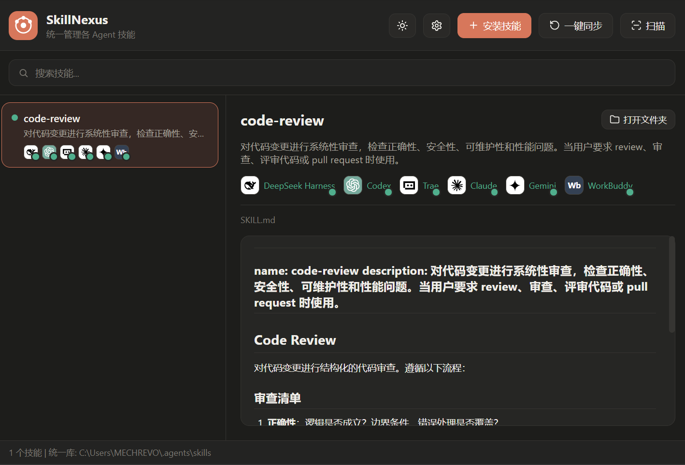

<div align="center">

# SkillNexus

**English** | [**简体中文**](README.md)


**One skill library, connected to all your agents.**

A cross-platform desktop tool that manages the skill libraries of AI coding agents (Claude Code, Codex, Gemini CLI, DeepSeek Harness, Cursor, Cline …). A single `~/.agents/skills` directory acts as the single source of truth, mapped into each agent's skill directory via junctions / symlinks. Agents that natively read `~/.agents/skills` are connected directly, with zero configuration.

</div>

---

## ⬇️ Download

> Just want to use it? Grab the latest build for Windows — no compilation needed.

| File | Link |
|------|------|
| 📦 Windows installer | [SkillNexus_0.3.0_x64-setup.exe](https://github.com/Halface525/skill-nexus/releases/latest/download/SkillNexus_0.3.0_x64-setup.exe) |
| 🟢 Windows portable | [SkillNexus.exe](https://github.com/Halface525/skill-nexus/releases/latest/download/SkillNexus.exe) |

Other platforms or older versions: see [Releases](https://github.com/Halface525/skill-nexus/releases/latest).

> ~9MB installer, double-click to install on Win10/11. No runtime required.

---

## ✨ Features

- **Unified skill library** — all skills live in one directory; manage once, apply everywhere
- **One-click sync** — automatically creates links for every installed agent, so skills are ready instantly
- **Smart detection** — only counts an agent as installed when its command is on PATH or its config dir has real data (no leftover-directory false positives)
- **Two-level toggles** — global (does this agent use any skills?) + per-skill (does this skill go to this agent?)
- **Install / uninstall skills** — pick any folder containing a `SKILL.md` to install; uninstall removes it and all links in one click
- **Add custom agents** — 24 mainstream agents built in; anything else can be added manually, with an optional "always treat as installed" flag
- **Migratable library** — first-run wizard picks the location; once the library is outside the system default path, every agent can be controlled individually
- **SKILL.md rendering** — full Markdown rendering (headings / code blocks / tables / quotes) in the detail panel
- **Brand badges** — each agent shown as an official logo / brand-color badge
- **About panel** — version info + update check against GitHub Releases
- **Light / Dark / System** themes + **Simplified Chinese / English** UI

## 🗂️ Architecture

All agents' skills converge into one **unified library**, connected in two ways:

| Type | How it works | Example agents |
|------|--------------|----------------|
| **direct** | Natively reads `~/.agents/skills`, and **also has its own dedicated skill directory** (e.g. Codex → `~/.codex/skills`, dsh → `~/.dsh/skills`) | DeepSeek Harness, Codex, Cursor, Trae, GitHub Copilot |
| **junction** | Agent has a fixed skill directory, linked to the library via **junction** (Windows) / **symlink** (macOS/Linux) | Claude, Cline, Gemini CLI, Qwen Code, Kiro |

> **Library location controls the granularity**: the library defaults to `~/.agents/skills`. On first run you can migrate it anywhere; once it is outside the convention path, **every agent (including "direct" ones) gets its skill links created in its own directory** (e.g. `~/.codex/skills`, `~/.dsh/skills`), so all of them can be controlled individually. Only a custom "direct" agent without its own directory falls back to the shared `~/.agents/skills` (group control).

```
                ┌─────────────────────┐
                │   ~/.agents/skills   │  ← Unified library (source of truth)
                └──────────┬──────────┘
                           │
          ┌────────────────┼────────────────┐
          │                │                │
   junction/symlink        │          direct read
          │                │                │
   ┌──────▼──────┐  ┌──────▼──────┐  ┌──────▼──────┐
   │ ~/.claude/   │  │ ~/.gemini/  │  │ Codex /     │
   │  skills      │  │  skills     │  │ Cursor / …  │
   └─────────────┘  └─────────────┘  └─────────────┘
```

## 📸 Screenshots



## 🖥️ Tech Stack

- **Desktop framework**: [Tauri 2](https://tauri.app/) (Rust core + system WebView)
- **Backend**: Rust — directory scanning, junction/symlink management, SKILL.md parsing
- **Frontend**: [React 19](https://react.dev/) + [TypeScript](https://www.typescriptlang.org/) + [Vite](https://vite.dev/)
- **Icons**: official brand icons from simple-icons + inline SVG
- **Markdown rendering**: [react-markdown](https://github.com/remarkjs/react-markdown)

## 📦 Requirements

| Dependency | Version | Note |
|------------|---------|------|
| [Node.js](https://nodejs.org/) | ≥ 18 | Frontend build |
| [Rust](https://www.rust-lang.org/) | ≥ 1.77 | Backend compilation |

Tauri platform prerequisites (per OS):

- **Windows**: Microsoft C++ Build Tools (with the C++ workload), [WebView2](https://developer.microsoft.com/microsoft-edge/webview2/) (built-in on Win11)
- **macOS**: Xcode Command Line Tools
- **Linux**: `webkit2gtk-4.1`, `libappindicator`, etc. See [Tauri prerequisites](https://tauri.app/start/prerequisites/)

## 🚀 Getting Started

```bash
# 1. Clone the repository
git clone https://github.com/Halface525/skill-nexus.git
cd skill-nexus

# 2. Install dependencies
npm install

# 3. Run in development mode (a desktop window opens automatically)
npm run tauri dev
```

## 📦 Build

```bash
npm run tauri build
```

Artifacts are produced in `src-tauri/target/release/`:

- `bundle/nsis/*.exe` — installer (recommended for sharing)
- `SkillNexus.exe` — standalone portable binary

> The built exe has no Rust / Node dependencies — double-click and run (WebView2 is built into Win10/11).

## ⚙️ Configuration

### Agent list — `~/.agents/agents.json`

Generated on first run; edit it to add or remove any agent without touching code:

```json
{
  "agents": [
    {
      "name": "Claude",
      "kind": "junction",
      "dir": ".claude/skills",
      "binary": "claude",
      "homeDir": ".claude"
    },
    {
      "name": "Codex",
      "kind": "direct",
      "binary": "codex",
      "homeDir": ".codex"
    }
  ]
}
```

| Field | Description |
|-------|-------------|
| `name` | Display name |
| `kind` | `direct` reads the unified library / `junction` creates a link |
| `dir` | Skill directory (relative to home; `appdata/` prefix resolves to `%APPDATA%`). Required for junction and "direct with own directory" agents, e.g. `.claude/skills`, `.codex/skills`, `appdata/devin/skills` |
| `binary` | Detection: executable name (optional). The command being on PATH is strong evidence the agent is installed |
| `homeDir` | Detection: config directory under home (optional). Counted as installed only if it contains real data beyond the `skills` subdirectory created by syncing — this avoids false positives from leftover directories (e.g. a leftover `~/.gemini`) |
| `appdata` | Detection: considered installed if these application directories exist under `%APPDATA%`, e.g. `["Trae CN"]` (optional) |
| `enabled` | Use toggle (optional, default `true`). `false` stops syncing that agent and removes its links |
| `manual` | Always treat as installed (optional, default `false`). `true` skips detection — for custom agents |

> You can add or disable agents from the app's **Scan** panel; no need to edit this file by hand.

### Per-skill exclusions — `~/.agents/skill_agents.json`

Controls whether a specific skill is linked to a specific agent (managed from the skill's detail panel):

```json
{
  "excluded": {
    "nature-writing": ["WorkBuddy"]
  }
}
```

A skill is linked to every enabled agent by default; agents in the exclusion list get no link. Toggling takes effect immediately.

### Library location — `~/.agents/settings.json`

```json
{
  "unifiedLibrary": "D:/MySkills",
  "librarySetup": true
}
```

- A first-run wizard guides the location choice and can migrate existing skills (the source folder is kept as `.bak`)
- When the library is at the system default `~/.agents/skills`, "direct-read" agents cannot be controlled individually; migrating elsewhere enables fine-grained control over all of them
- Change it anytime from **Settings → Unified Library Location** (migrates and auto-syncs)

## 🤖 Built-in Agents (24)

| Direct read (each with its own directory) | Junction (link) |
|-------------|-----------------|
| DeepSeek Harness · Codex · Cursor · Antigravity · Aider · Windsurf · Trae · GitHub Copilot · Devin · Amp | Claude · Cline · Roo Code · Gemini · OpenCode · Goose · Kiro · WorkBuddy · Qwen Code · Kilo Code · OpenHands · iFlow · Kimi · Grok |

The dedicated skill directories of the direct agents:

| Agent | Own skill directory |
|-------|---------------------|
| DeepSeek Harness | `~/.dsh/skills` |
| Codex | `~/.codex/skills` |
| Cursor | `~/.cursor/skills` |
| Antigravity | `~/.gemini/antigravity/skills` |
| Aider | `~/.aider/skills` (no auto-scan by default; configure in `.aider.conf.yml`) |
| Windsurf | `~/.codeium/windsurf/skills` |
| Trae | `~/.trae-cn/skills` (international: `~/.trae/skills`) |
| GitHub Copilot | `~/.copilot/skills` |
| Devin | `%APPDATA%\devin\skills` |
| Amp | `~/.config/amp/skills` |

> Any other agent can be added by editing `agents.json`; a "direct" agent with a `dir` gets individual control.

## 📁 Project Structure

```
skill-nexus/
├── src/                        # Frontend (React + TS)
│   ├── App.tsx                 # Main UI
│   ├── AgentBadge.tsx          # Agent brand badge component
│   ├── agents.ts               # Agent brand color / logo mapping
│   ├── i18n.ts                 # zh / en dictionary
│   └── icons.tsx               # SVG icon set
└── src-tauri/                  # Backend (Rust)
    ├── src/core.rs             # Core logic: scan / link / sync / config
    ├── src/lib.rs              # Tauri command layer
    ├── Cargo.toml
    └── tauri.conf.json         # Window / bundling config
```

## 🙏 Credits

- [Agent Skills open specification](https://agentskills.io/specification) (SKILL.md)
- [simple-icons](https://simpleicons.org/) brand icon library
